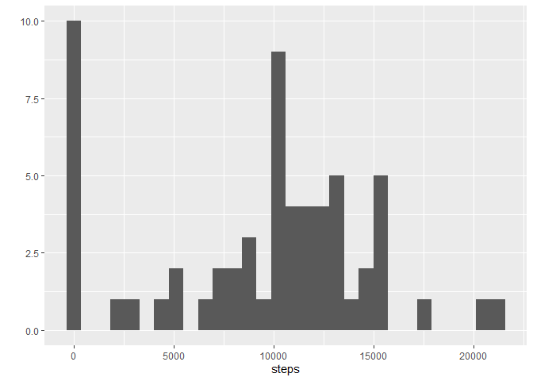
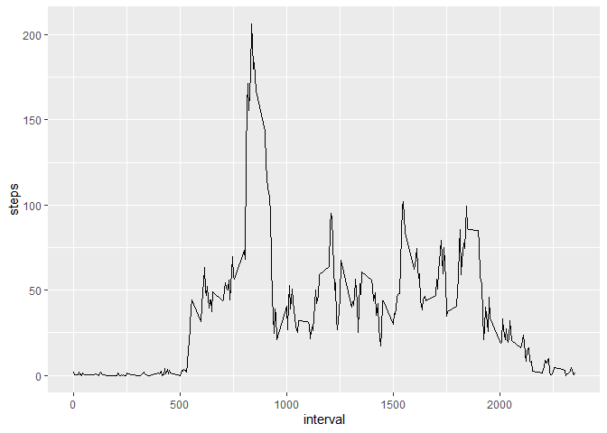
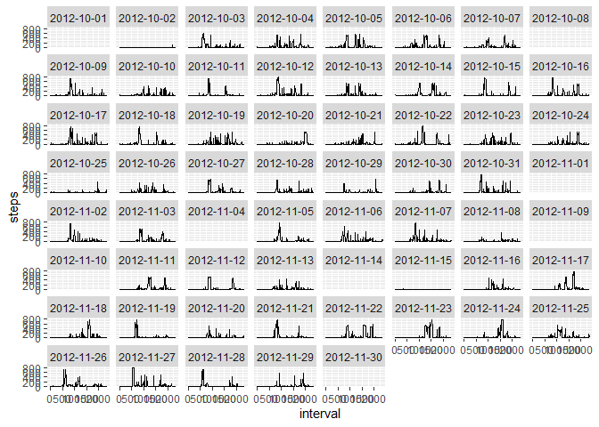
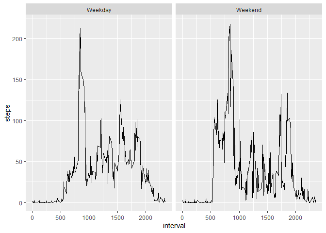

    
**Task 1 Code for reading in the dataset and/or processing the data**

First of all to set up the system. I loaded the included .zip and the libraries I wanted to use.


```r
knitr::opts_chunk$set(echo = TRUE, message = FALSE)

df <- read.csv(unz("activity.zip","activity.csv"))
df$date <- as.Date(df$date)

library(ggplot2)
library(dplyr)
```
       
**Task 2 Histogram of the total number of steps taken each day**


```r
t1 <- df %>%
  group_by(date) %>%
  summarize(
    steps = sum(steps, na.rm=TRUE)
  )
```
    
***Plot data ***


```r
qplot(steps, data=t1, geom='histogram')  
```

<!-- -->
     
**Task 3 Mean and median number of steps taken each day**

```r
c(mean(t1$steps),median(t1$steps))
```

```
## [1]  9354.23 10395.00
```
We can see that the person is averaging about 10k steps a day
  
**Task 4 Time series plot of the average number of steps taken**

With a new data series t2 calculating the average for each interval

```r
t2 <- df %>%
  group_by(interval) %>%
  summarize(
    steps = mean(steps, na.rm=TRUE)
  )
```
    
***We can plot the graph:***


```r
ggplot(t2, aes(x=interval, y=steps))+geom_line()  
```

<!-- -->
      
**Task 5 The 5-minute interval that, on average, contains the maximum number of steps**

To answer the question which interval that is, we arrange the frame in descending order by steps and extract the 1st element

```r
max_interval <- arrange(t2, -steps)[1,]
print(max_interval)
```

```
## # A tibble: 1 x 2
##   interval steps
##      <int> <dbl>
## 1      835  206.
```
 We find that the max interval is **interval 835**  


  
**Task 6 Code to describe and show a strategy for imputing missing data**

Looking at the data split by day, we find that the missing data correspond to specific whole days:

```r
t3 <- df %>%
   group_by(date) %>%
   summarize(
     steps = sum(is.na(steps))
   )
# t3[t3$steps>0,]


ggplot(df, aes(x=interval, y=steps))+geom_line()+facet_wrap(df$date)  
```

<!-- -->
    
Since the interval graph showed a clear pattern for the interval, the proposed solution is to fill in the missing date with the corresponding mean for each interval. There also seems to be days with improper measurements, so all days with less than 2000 steps will be disregarded for recalculating the mean.


```r
# Filter out erroneous days
referencedays <- t1 %>%
  filter(steps>2000)

# Calculate new means by interval
t4 <- df %>%
   filter(date %in% referencedays$date)%>%
   group_by(interval) %>%
   summarize(
     steps = mean(steps, na.rm=TRUE)
   )

dffixed <- df %>%
  left_join(t4, by ='interval', suffix = c("",".y")) %>%
  mutate(steps= ifelse(is.na(steps), steps.y, steps)) %>%
  select(steps, date, interval)
```
     
**Task 7 Histogram of the total number of steps taken each day after missing values are imputed**


```r
t5 <- dffixed %>%
  group_by(date)%>%
  summarize(
    steps=sum(steps)
  )


qplot(steps, data=t5, geom='histogram')
```

<!-- -->

```r
c(mean(t5$steps),median(t5$steps))
```

```
## [1] 10821.13 11185.12
```
Comparing the new mean and median with the unadjusted data, we can see that they've gone up with over 1000 steps each.  


**Task Panel plot comparing the average number of steps taken per 5-minute interval across weekdays and weekends**

```r
dffixed$weekday <- factor(weekdays(dffixed$date))
dffixed$weekday <- factor(weekdays(dffixed$date), labels =  c(rep('Weekday',5), rep('Weekend',2)))

t6 <- dffixed %>%
  group_by(interval, weekday)%>%
  summarize(
    steps=mean(steps)
  )


ggplot(t6, aes(x=interval, y=steps))+geom_line()+facet_grid( . ~ t6$weekday)
```

<!-- -->
     
**Task 8 All of the R code needed to reproduce the results (numbers, plots, etc.) in the report**  
All done. Have a nice day!
